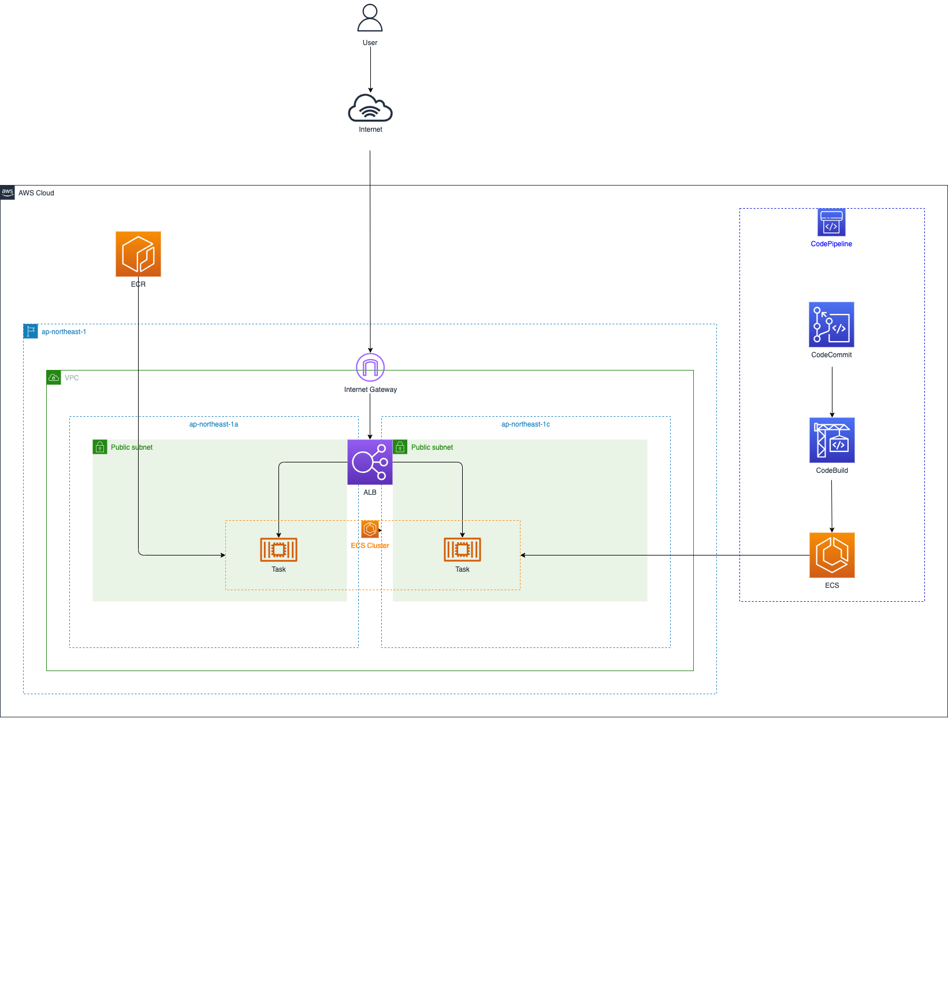

# cdk-microservices-rollingupdate-template

## Overview

This repository contains cdk template for microservices (rolling update) architecture.

&emsp;

## Diagram



## Required

- [AWS CLI](https://aws.amazon.com/cli) - v2 or later
- [AWS CDK](https://aws.amazon.com/jp/cdk) - v2 or later
- [Docker](https://www.docker.com/) - v20 or later
- [Node.js](https://nodejs.org/ja) - v16 or later
- [TypeScript](https://www.typescriptlang.org/) - v4 or later

## Getting Started

1. Clone this repository.

```shell
git clone https://github.com/tsukuboshi/cdk-microservices-rollingupdate-template
```

2. Change directory.

```shell
cd cdk-microservices-rollingupdate-template
```

3. Install npm packages.

```shell
npm install
```

4. If this is your first CDK deployment, run this command only once.

```shell
cdk bootstrap
```

5. Launch Docker Client Software.

6. Deploy CDK Code.


```shell
cdk deploy
```
